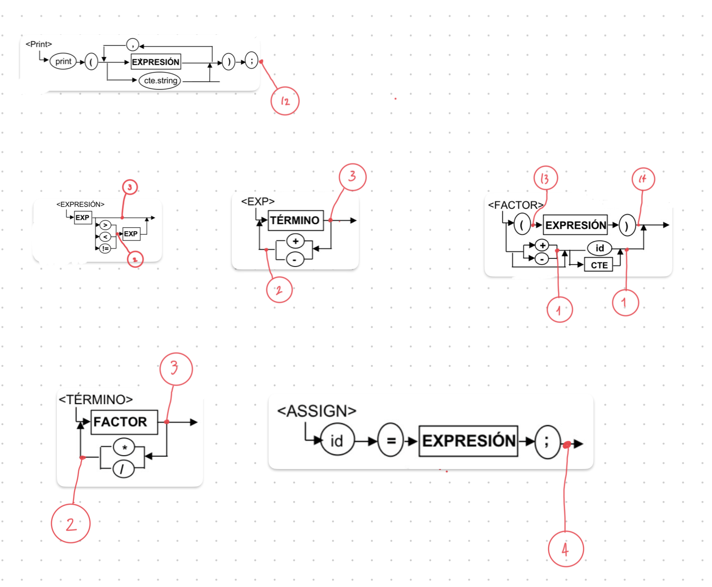

### Scanner y Parser con PLY
---

## 1. Seleccion de Herramienta de Generacion Automatica

### Analisis de Herramientas Evaluadas

Anteriormente, investigue tres herramientas para elaborar compiladores, para ello, considere las siguientes 3 herramientas:

#### Flex y Bison
Flex genera escaneres lexicos basados en automatas finitos deterministas, y Bison crea analizadores de sintaxis a partir de gramaticas libres de contexto 
- Conocimiento de C para el codigo de acciones
- Compilacion separada de archivos intermedios
- Manejo de archivos `.l` y `.y` con sintaxis especifica
- Proceso de compilacion adicional con herramientas de C

Aunque son muy poderosas y eficientes, su integracion con Python (el lenguaje seleccionado para este proyecto) requeriria bindings adicionales o comunicacion entre procesos, lo cual añade complejidad innecesaria.

### Flex y Bison

Flex y Bison son las herramientas mas para en el desarrollo de compiladores. Flex genera escaneres lexicos basados en automatas finitos deterministas, y Bison crea analizadores de sintaxis a partir de gramaticas libres de contexto. 

Se requiere de conocimiento en C para el la definicion de las acciones de los puntos neuralgicos, compilacion separada de archivos intermedios, manejo de archivos con extension .l y .y, y un proceso de compilacion adicional utilizando herramientas de C. 

### Lrparsing

Lrparsing ofrece un enfoque mas moderno, us expresiones de Python para definir gramaticas. Esta herramienta proporciona un parser LR con tokenizador integrado, pre-compilacion de gramatica para optimizar el rendimiento, y mecanismos de recuperacion de errores que permiten continuar el parseo incluso cuando se detectan problemas.

### PLY (Python Lex-Yacc) 

PLY es una implementacion completamente desarrollada en Python sin dependencias externas, lo que facilita su instalacion y uso. Usa la sintaxis y filosofia de Lex/Yacc, usa parseo LALR (Look-Ahead LR), tiene validacion automatica de entrada con reportes de errores , y no requiere archivos de entrada especiales ni compilacion separada como Flex/Bison, implementa  cache de tablas de parseo que solo regenera las tablas cuando detecta cambios en la gramatica, lo que optimiza el ciclo de desarrollo.

Decidi utilizar a PLY debido a que cuenta con bastante documentacion y cuenta con muchos ejemplos que facilitan la comprehencion de el proceso de elaboracion del parser.

---

## Estructura del Compilador

### lex.py - Analizador Lexico
Contiene la definicion de tokens y expresiones regulares para el lenguaje.

Dentro de lex se define a la lista de tokens y a las expresiones del lenguaje, donde para PLY, se definen primero a las palabras reservadas en formato de un diccionario, donde la llave es palabra escrita de la manera en la que sera reconocida en el codigo, y el valor sera nombre del token que esperariamos. Luego creamos el arreglo de tokens que esperaremos, y le concatenamos a los valores de el diccionario de palabras reservadas, despues de esto procedemos a definir las expresiones regulares para cada token, donde primero definimos a las expresiones regulares de los caracteres individuales como variables, luego definimos a las expresiones regulares mas complicadas, como CNT_FLOAT, CNT_INT, ID, y CNT_STRING, espues inclui una regla gramaticar para ignorar espacios y tabs para que el programa no se detenga cuando detecte saltos de linea, lugo defini una regla que me de un conteo de lineas, y una regla para definir el manejo de errores del lexer, donde recibo e imprimo el error y luego salto al siguiente token.

#### `yacc.py` - Analizador Sintactico
Implementa las reglas gramaticales y construye el Arbol de Sintaxis Abstracta (AST).

Primero defino el simbolo de inicio, este sera la gramatica que empiece el programa, luego defino las producciones de la gramatica, esto lo logro mediante escribir a las gramaticas libres de contexto en forma de docstrings que yacc usa para la formacion de las tablas y definir a p[0] (indice del resultado) como el indice que representa al valor semantico que queremos que represente ese simbolo en el arbol de parseo. Luego agrego una regla para el manejo de errores.

#### Pruebas
Contiene casos de prueba exhaustivos para validar el funcionamiento del compilador, donde test_lexer.py contiene las pruebas del lexer y test_parse.py contiene las pruebas del parser, el cual emplea al lexer.

---

## Definicion de Expresiones Regulares

### Palabras Reservadas

Defini a las palabras reservadas mediante un diccionario que mapea el texto de la palabra a su tipo de token:

```python
reserved_namespace = {
    'int'     : 'INT',
    'float'   : 'FLOAT',
    'var'     : 'VAR',
    'program' : 'PROGRAM',
    'void'    : 'VOID',
    'if'      : 'IF',
    'else'    : 'ELSE',
    'while'   : 'WHILE',
    'do'      : 'DO',
    'print'   : 'PRINT',
    'main'    : 'MAIN',
    'end'     : 'END',
}
```

### Tokens Simples

Los operadores y delimitadores se definen mediante expresiones regulares sencillas que se asignan a variables:

| Token | Expresion Regular | Descripcion |
|-------|------------------|-------------|
| `COMMA` | `,` | Coma |
| `COLON` | `:` | Dos puntos |
| `SEMI_COLON` | `;` | Punto y coma |
| `L_CBRACKET` | `\{` | Llave izquierda |
| `R_CBRACKET` | `\}` | Llave derecha |
| `L_SBRACKET` | `\[` | Corchete izquierdo |
| `R_SBRACKET` | `\]` | Corchete derecho |
| `L_PARENTHESIS` | `\(` | Parentesis izquierdo |
| `R_PARENTHESIS` | `\)` | Parentesis derecho |
| `EQUAL` | `=` | Igual |
| `PLUS` | `\+` | Suma |
| `MINUS` | `-` | Resta |
| `ASTERISK` | `\*` | Multiplicacion |
| `FORWARD_SLASH` | `/` | Division |
| `NOT_EQUAL` | `!=` | Diferente de |
| `GREATER_THAN` | `>` | Mayor que |
| `LOWER_THAN` | `<` | Menor que |

### Tokens Complejos

Los tokens con patrones complejos se definen mediante funciones:

#### CNT_FLOAT
```python
def t_CNT_FLOAT(t):
    r'\d+\.\d+(e[+-]?\d+)?'
    t.value = float(t.value)
    return t
```

**Patron:** Uno o mas digitos, seguido de punto decimal, uno o mas digitos, opcionalmente seguido de notacion cientifica (e/E seguido de signo opcional y digitos).

**Ejemplos validos:** `3.14`, `2.5e10`, `1.0e-5`

#### CNT_INT
```python
def t_CNT_INT(t):
    r'\d+'
    t.value = int(t.value)
    return t
```
**Patron:** Uno o mas digitos.

**Ejemplos validos:** `0`, `42`, `1000`

#### CNT_STRING
```python
def t_CNT_STRING(t):
    r'"([^"\\]|\\.)*"'
    t.value = t.value[1:-1]  # Remover comillas
    return t
```
**Patron:** Comillas dobles, seguidas de cualquier caracter excepto comillas o backslash (o secuencias de escape), terminando en comillas dobles.

**Ejemplos validos:** `"hola"`, `"valor: 10"`, `"con \"escape\""`

#### ID
```python
def t_ID(t):
    r'[a-zA-Z_]\w*'
    t.type = reserved_namespace.get(t.value, 'ID')
    return t
```
**Patron:** Letra o guion bajo, seguido de cero o mas caracteres alfanumericos o guiones bajos.

**Ejemplos validos:** `x`, `variable1`, `_temp`, `miVariable`

### Manejo de Espacios y Comentarios

```python
# Ignorar espacios y tabs
t_ignore = ' \t'

# Contar lineas
def t_newline(t):
    r'\n+'
    t.lexer.lineno += len(t.value)
```

**Importante:** PLY evalua las reglas revizando primero a las funciones definidas antes que otras funciones, luego a las expresiones regulares mas largas antes que a las cortas, y luego al orden de definicion en el codigo.
poreso, t_CNT_FLOAT debe definirse antes que t_CNT_INT, ya que 3.14 podria ser interpretado incorrectamente como 3, . , 14 y daria un error por el punto.

---

## Reglas Gramaticales

### Estructura del Programa
Primero se define a la gramatica que empieza al programa, esta es program

### Implementacion
```python
def p_program(p):
    """program : PROGRAM ID SEMI_COLON vars func_list MAIN body END
               | PROGRAM ID SEMI_COLON func_list MAIN body END
               | PROGRAM ID SEMI_COLON vars MAIN body END
               | PROGRAM ID SEMI_COLON MAIN body END"""
    
    if len(p) == 9:
        p[0] = ('program', p[2], p[4], p[5], p[7])
    elif len(p) == 8:
        if isinstance(p[4], tuple) and p[4][0] == 'vars':
            p[0] = ('program', p[2], p[4], [], p[6])
        elif isinstance(p[4], list):
            p[0] = ('program', p[2], None, p[4], p[6])
        else:
            p[0] = ('program', p[2], None, [], p[5])
    else:
        p[0] = ('program', p[2], None, [], p[5])
```

### Variables

```
<VARS> → var <var_list>
<var_list> → <id_list> : <type> ; <var_list'>
<var_list'> → <var_list> | ε
<id_list> → id <id_list'>
<id_list'> → , <id_list> | ε
<type> → int | float
```

Permite declarar multiples variables del mismo tipo y declaraciones consecuticas.

### Expresiones Aritmeticas

```
<EXP> → <EXP> + <TERMINO>
      | <EXP> - <TERMINO>
      | <TERMINO>

<TERMINO> → <TERMINO> * <FACTOR>
          | <TERMINO> / <FACTOR>
          | <FACTOR>

<FACTOR> → ( <EXPRESION> )
         | + id | + <CTE>
         | - id | - <CTE>
         | id
         | <CTE>

<CTE> → cte_int | cte_float
```

### Precedencia de operadores
1. `+`, `-` (suma, resta)
2. `*`, `/` (multiplicacion, division)
3. Operadores unarios `+`, `-`
4. Parentesis `( )`

### Expresiones

```
<EXPRESION> → <EXP> <EXPRESION'>
<EXPRESION'> → > <EXP>
             | < <EXP>
             | != <EXP>
             | ε
```

### Condiciones y ciclos

#### Condicional
```
<CONDITION> → if ( <EXPRESION> ) <Body> ;
            | if ( <EXPRESION> ) <Body> else <Body> ;
```

#### Ciclo 
```
<CYCLE> → while ( <EXPRESION> ) do <Body> ;
```

### Funciones

```
<FUNCS> → void id ( <param_list> ) [ [<VARS>] <Body> ] ; <func_list'>
<func_list'> → <FUNCS> | ε

<param_list> → id : <type> <param_list'>
<param_list'> → , <param_list> | ε
```
Se permiten definiciones de variables locales

### Statements

```
<Body> → { <statement_list> }
       | { }

<statement_list> → <statement> <statement_list'>
<statement_list'> → <statement_list> | ε

<statement> → <assign>
            | <condition>
            | <cycle>
            | <f_call>
            | <print_stmt>

<assign> → id = <EXPRESION> ;

<f_call> → id ( [<expression_list>] ) ;

<print_stmt> → print ( <print_expression_list> ) ;
<print_expression_list> → (<expression> | cte_string) <print_list'>
<print_list'> → , <print_expression_list> | ε
```

---

## Plan de Pruebas y Casos de Prueba

### Analisis Lexivo

Se creo un archivo de python donde se incluyo un string y un print que arroja a los tokens detectados, la linea donde se encontro y su valor, corrio de manera exitosa y sin errores, todos los tokens fueron detectadis correctamente.

### Casos de Prueba del Analisis Sintactico

#### Test 1: Programa Minimo
Se debe de verificar la estructura basica de un programa.

**Entrada:**
```
program test1;
main {
}
end
```

**AST Esperado:**
```python
('program', 'test1', None, [], ('body', []))
```

#### Test 2: Programa con Variables
Se debe de validar declaracion de variables globales.

**Entrada:**
```
program test2;
var
    x : int;
    y, z : float;
main {
}
end
```

**AST Esperado:**
```python
('program', 'test2',
  ('vars', [
    ('var_declaration', ['x'], 'int'),
    ('var_declaration', ['y', 'z'], 'float')
  ]),
  [],
  ('body', [])
)
```

#### Test 3: Expresiones Aritmeticas
Se debe de verificar precedencia y asociatividad de operadores.

**Entrada:**
```
program test3;
var
    x, y, z : int;
main {
    x = 5 + 3;
    y = x * 2;
    z = (x + y) / 2;
}
end
```

**AST Esperado (fragmento de `z`):**
```python
('assign', 'z',
  ('/', ('+', 'x', 'y'), 2)
)
```

#### Test 4: Condicional If Simple
Se debe de validar estructura if sin else.

**Entrada:**
```
program test4;
var
    x : int;
main {
    x = 10;
    if (x > 5) {
        x = x + 1;
    };
}
end
```

**AST Esperado:**
```python
('if',
  ('>', 'x', 5),           # condicion
  ('body', [               # then
    ('assign', 'x', ('+', 'x', 1))
  ]),
  None                     # sin else
)
```

#### Test 5: Condicional If-Else
Se debe de validar estructura if-else completa.

**Entrada:**
```
program test5;
var
    x : int;
main {
    x = 3;
    if (x > 5) {
        x = 10;
    } else {
        x = 0;
    };
}
end
```

#### Test 6: Ciclo While
Se debe de verificar estructura de ciclos.

**Entrada:**
```
program test6;
var
    x : int;
main {
    x = 0;
    while (x < 10) do {
        x = x + 1;
    };
}
end
```

**AST Esperado:**
```python
('while',
  ('<', 'x', 10),          # condicion
  ('body', [               # cuerpo del ciclo
    ('assign', 'x', ('+', 'x', 1))
  ])
)
```

#### Test 7: Funcion Print
Se debe de validar impresion de expresiones y strings.

**Entrada:**
```
program test7;
var
    x : int;
main {
    x = 42;
    print(x);
    print("El valor es:", x);
}
end
```

**AST Esperado:**
```python
('print', ['x'])
('print', ['El valor es:', 'x'])
```

#### Test 8: Declaracion de Funciones
Se debe de verificar sintaxis de funciones con parametros y variables locales.

**Entrada:**
```
program test8;
void myFunc(a : int, b : int) [
    var
        result : int;
    {
        result = a + b;
    }
];
main {
}
end
```

**AST Esperado:**
```python
('func', 'myFunc',
  [('a', 'int'), ('b', 'int')],  # parametros
  ('vars', [                      # variables locales
    ('var_declaration', ['result'], 'int')
  ]),
  ('body', [                      # cuerpo
    ('assign', 'result', ('+', 'a', 'b'))
  ])
)
```

#### Test 9: Programa Completo
Se debe de validar integracion de todas las caracteristicas del lenguaje.

**Entrada:**
```
program completo;
var
    x, y : int;
    z : float;

void calcular(a : int, b : int) [
    var
        resultado : int;
    {
        resultado = a + b;
    }
];

main {
    x = 10;
    y = 20;
    z = 3.14;

    if (x < y) {
        print("x es menor que y");
    } else {
        print("x es mayor o igual que y");
    };

    while (x < 100) do {
        x = x + 1;
    };

    calcular(x, y);
}
end
```

### Casos de Prueba de Errores Sintacticos

#### Error 1: Falta Punto y Coma
**Entrada:**
```
program test1
var
    x : int;
main {
}
end
```

**Salida:**
```
Syntax error at token VAR ('var') on line 2
```

#### Error 2: Falta Dos Puntos en Declaracion
**Entrada:**
```
program test2;
var
    x int;
main {
}
end
```

**Salida:**
```
Syntax error at token INT ('int') on line 3
```

#### Error 3: Falta Punto y Coma en Asignacion
**Entrada:**
```
program test3;
var
    x : int;
main {
    x = 5
}
end
```

**Salida:**
```
Syntax error at token R_CBRACKET ('}') on line 6
```

#### Error 4: Parentesis Sin Cerrar
**Entrada:**
```
program test4;
var
    x : int;
main {
    if (x > 5 {
        x = 10;
    };
}
end
```

**Salida:**
```
Syntax error at token L_CBRACKET ('{') on line 5
```

#### Error 5: Falta Palabra Clave 'end'
**Entrada:**
```
program test5;
main {
    x = 5;
}
```

**Salida:**
```
Syntax error: Unexpected end of file (EOF)
```

---

## Analisis semantico

### semantic_cube.py - Cubo semantico

El cubo semantico es una estructura de datos que define las reglas de compatibilidad de tipos para todas las operaciones del lenguaje. Proporciona validacion de operaciones binarias mediante consultas de tipos.

En mi caso lo implememte con un diccionario de tres niveles donde se consulta mediante la estructura cubo[operador][tipo_izquierdo][tipo_derecho] para obtener el tipo resultante, los tipos soportados son int y float, y el resultado puede ser uno de estos tipos o None si la operacion es invalida.

#### Operadores y Reglas de Tipo

Los operadores se organizan en cuatro categorias: aritmeticos (suma, resta, multiplicacion), division especial, relacionales, y asignacion.

Para operadores aritmeticos de suma, resta y multiplicacion, las reglas son que int operado con int produce int, int con float produce float, float con int produce float, y float con float produce float. Esto nos permite realizar operaciones entre ints y floats, y realizar conversiones de int a float de ser necesario, para la division, todas las combinaciones producen float, los operadores relacionales mayor que, menor que y diferente a, todas las combinaciones de operandos producen int que representa un valor booleano (0 u 1), la asignacion, valida compatibilidad permitiendo asignacion de int a float con promocion implicita, pero int no puede recibir float directamente.

#### Metodos Principales

El cubo semantico proporciona dos metodos principales:
- El metodo get_result_type recibe un operador y dos tipos de operandos, y arroja el tipo resultante o None si la operacion es invaida
- El metodo is_valid_operation verifica si una operacion es valida sin la necesidad de consultar el tipo especifico

### Analizador semantico

El analizador semantico usa al cubo semantico con las estructuras de datos para realizar validacion semantica del programa durante el parseo. Contiene referencias al directorio de funciones, la funcion actual siendo analizada, y una lista con los errores encontrados.

#### Puntos Neuralgicos - Inicializacion y Funciones

El punto neuralgico np_start_program cprre cuando se reconoce la declaracion del programa (program ID;) e inicializa el analisis estableciendo el nombre del programa.

El punto neuralgico np_start_function corre cuando comienza la declaracion de una funcion verificando que no este doblemente declarada, creandola en el directorio, y estableciendo que todos los elementos siguientes pertenecen a esa funcion hasta que termine.

El punto neuralgico np_end_function corre cuando finaliza la declaracion de una funciony arroja el ambito al global.

El punto neuralgico np_add_parameter se ejecuta para cada parametro en la lista de parametros validando que no este doblemente declarado y agregandolo como variable local de la funcion.

#### Puntos Neuralgicos - Variables

El punto neuralgico np_declare_variable se ejecuta al reconocer una declaracion de variable (ID : type;). Valida que la variable no este doblemente declarada en el ambito actual y la agrega a la tabla global si es variable global, o a la tabla local de la funcion actual si es local.

El punto neuralgico np_check_variable se ejecuta cuando se usa una variable en una expresion, busca la variable en el scope actual implementando la regla que las variables locales ocultan las globales, luego arroja al tipo de la variable si existe.

#### Puntos Neuralgicos - Operaciones

El punto neuralgico np_check_operation corre cuando se completa una operacion binaria, consulta el cubo semantico para obtener el tipo resultante y registra un error si la operacion no es valida, el tipo resultante se almacena para su uso.

El punto neuralgico np_check_assignment corre cuando se completa una asignacion (ID = expression;), este verifica que la variable exista, obtiene su tipo, consulta el cubo semantico con el operador = para validar que el tipo de la expresion sea compatible con el tipo de la variable, y registra error si no lo es.

#### Puntos Neuralgicos - Llamadas a Funcion

El punto neuralgico np_start_function_call corre cuando comienza una llamada a funcion verificando que la funcion este declarada y obteniendo su informacion.

El punto neuralgico np_check_function_call corre al completar una llamada a funcion, valida que el numero de argumentos sea correcto, que cada tipo de argumento sea compatible con el tipo del parametro correspondiente, y registra errores especificos indicando cual argumento es incompatible.

#### Helpers

El metodo get_literal_type determina si un valor es entero o flotante basandose en el tipo de Python, el metodo print_symbol_tables imprime todas las tablas de simbolos tanto globales como de cada funcion para debugging, por ultomo, el metodo reset reinicia el analizador para evitar interferencias con programas anteriores.

---

### Estructuras de Datos para Analisis semantico

#### FunctionDirectory

Lo impolemente usando un diccionario ya que permite acceso rapido a las funciones por nombre y acceso directo a la tabla global, el diccionario se compone de funciones mapeadas por nombre, una referencia a la funcion siendo analizada, y una tabla de variables globales.

Las operaciones principales son add_function para agregar una funcion verificando no este duplicada, get_function para obtener una funcion por nombre, function_exists para verificacion rapida, set_current_function para cambiar el ambito actual, add_global_variable y add_local_variable para declarar variables en el ambito apropiado, y lookup_variable para buscar variables implementando por scope, verificando primero a las locales y luego a las globales.

#### VariableTable

La implemente con un diccionario debio a que permite busquedas or nombre rapidas, insercion rapida e iteracion eficiente, este diccionario mapea nombres de variables a objetos Variable.

Las operaciones principales son add_variable que agrega una variable verificando no exista dos veces, get_variable que busca una variable por nombre, variable_exists para verificacion rapida, y get_all_variables para obtener la lista completa cuando se necesita.

#### Variable

Contiene el nombre de la variable, su tipo, y el scope donde fue declarada

#### Function

Contiene el nombre de la funcion, su tipo de retorno , una lista de parametros con sus tipos, una tabla de variables para las variables locales, y un campo start_address para generacion de codigo.

Las funciones principales son add_parameter que agrega un parametro como variable local, add_local_variable para agregar variables locales, get_variable para busqueda de variables locales, y get_parameter_types para obtener la lista de tipos de parametros en orden.

---

## Integracion de Analisis semantico

El analisis semantico se integra en el parser yacc.py donde cada regla gramatical  invoca los puntos neuralgicos del analizador semantico, cuando el parser reconoce un token o completa una regla, ejecuta el punto neuralgico correspondiente que valida la semantica y actualiza las estructuras de datos, por ejemplo, cuando se parsea una declaracion de variable, yacc.py llama a np_declare_variable para validar y registrar la variable.

El analizador junta todos los errores encontrados sin parar el parseo, lo que permite mostrar multiples errores en una sola ejecucion, lo que facilita el debugging.

Las tablas de simbolos se construyen durante el analisis, cuando se termina el parseo completo, se puede consultar el directorio de funciones para obtener informacion sobre todas las funciones y variables del programa, asi como la lista de errores encontrados.

## Generacion de Cuadruplos 

Genere una clase llamada IntermediateCodeGenerator con el fin de separar la logica de la generacion de cuadruplos, dentro de esta clase inclui un singleton con el fin de poder utilizar al mismo objeto de manera global, la clase se inicializa de la siguiente manera:
```python 
class IntermediateCodeGenerator:
    def __init__(self):
        self.quads = []
        
        # Pilas
        self.operator_stack = []
        self.operand_stack = []
        
        self.type_stack = []
        
        # Aqui guardamos el salto pendiente previo a evaluar una condicion (if, while)
        self.jump_stack = [] 
        
        self.temp_var_counter = 0 # Contador de variables temporales
```

Donde se inicializan las pias para los cuadruplos, operadores, operandos, tipos y saltos (cuadruplos que tienen que ser completados despues de que se define el resultado de la condicion del if o while).

Es importante aclarar que las variables temporales no cuentan con una pila propia ya que estas se almacenan dentro de la pila de operandos y su tipo se almacena dentro de la pila de operadores (una variable temporal representa el resultado de una operacion, este tipo es asignado por el cubo semantico), por ello, tenemos un contador que facilita la generacion de las mismas.

La clase cuenta con metodos que permiten realizar acciones CRUD con los atributos de la clase:

```python
    # Agregar un operador a la pila
    def push_operator(self, operator):
        self.operator_stack.append(operator)
    
    # Eliminamos uno de los operadores de la fila de operadores, primero revizamos si existe
    # si existe, eliminamos el elemento de la pila y lo arrojamos
    # si no existe, arrojamos un nulo
    def pop_operator(self):
        if self.operator_stack:
            return self.operator_stack.pop()

        return None

    # Retornamos el elemento mas nuevo de la pila, usamos el indice -1 ya que corresponde al ultimo elemento agregado
    def peak_operator(self):
        if self.operator_stack:
            return self.operator_stack[-1]
        return None
    
    def push_jump(self, position):
        self.jump_stack.append(position)
    
    def pop_jump(self):
        if self.jump_stack:
            return self.jump_stack.pop()

        return None
    
    def add_temp(self):
        self.temp_var_counter += 1
        return f"t{self.temp_var_counter}"
        
    def add_quad(self, operator, arg1, arg2, result):
        quad = (operator, arg1, arg2, result)
        self.quads.append(quad)
        
        # Indice en el cual se almaceno el cuadruplo agregado
        return len(self.quads) - 1
```

Separare algunos metodos que tienen un comportamiento distinto
```python
    def push_operand(self, operand, operand_type):
            self.operand_stack.append(operand)
            self.type_stack.append(operand_type)
        
    def pop_operand(self):
        if self.operand_stack and self.type_stack:
            operand = self.operand_stack.pop()
            operand_type = self.type_stack.pop()
            
            return operand, operand_type

        return None, None
```

Las operaciones realizadas en la pila de operandos se aplican al mismo tiempo en la pila de tipos, esto debido a que un operador va ligado a su tipo, esto nos es util particularmente al momento de generar cuadruplos para las operaciones aritmeticas, ya que es necesario evaluar el tipo de dato que tendra la variable temporal resultante despues de evaluar una expresion.

Tenemos la siguientes estructuras:

### Pila de Operadores - operator_stack
Almacena operadores binarios (+, -, *, /) durante el analisis de expresiones aritmeticas. Se pushea un operador cuando se encuentra en la expresion y se saca cuando debe generarse un cuadruplo para una expresion aritmetica. Permite manejar la precedencia y asociatividad de operadores.

### Pila de Operandos - operand_stack
Almacena operandos (variables, constantes, resultados temporales) de las expresiones. Se pushea cada operando antes de procesarlo y se sacan dos operandos cuando se genera un cuadruplo aritmetico, funciona en paralelo con la pila de tipos.

### Pila de Tipos - type_stack
Mantiene sincronizado el tipo de dato de cada operando en la pila de operandos. Se pushea y popea junto con cada operando para validar operaciones con el cubo semantico y determinar el tipo resultante de variables temporales.

### Pila de Saltos - jump_stack
Almacena posiciones de cuadruplos GOTOF y GOTO pendientes de llenar, se pushea la posicion cuando se genera un salto condicional y se saca cuando se conoce el destino final, sirve para implementar estructuras de control (if-else, while).

### Fila de Cuadruplos - quads
Almacena secuencialmente todos los cuadruplos generados como tuplas (operador, arg1, arg2, resultado), representa el codigo intermedio que sera ejecutado. Se agrega con add_quad() que retorna el indice, permitiendo llenar quadruplos pendientes por los saltos usando fill_quad().

## Memoria de Ejecucion 

Se realizo una memoria de ejecucion la cual se divide en las siguientes partes, primero tenemos a las direcciones de memoria, utilice dos diccionarios para manejarlas, un contador para incrementar las direcciones de memoria, cuyos valores incremento conforme asigno direcciones de memoria, y un diccionario cuyos valores son la el indice maximo que puede alcanzar cada variable.

```python
        # Contadores para asignar a la siguiente direccion disponible
        self.memory_counters = {
            'global_int' : 1000,
            'global_float' : 2000,
            'local_int' : 3000,
            'local_float' : 4000,
            'temp_int' : 5000,
            'temp_float' : 6000,
            'const_int' : 7000,
            'const_float' : 8000,
            'const_string' : 9000
        }
        
        # Diccionario con los limites superiores para cada grupo
        self.assignment_limits = {
            'global_int' : 1999,
            'global_float' : 2999,
            'local_int' : 3999,
            'local_float' : 4999,
            'temp_int' : 5999,
            'temp_float' : 6999,
            'const_int' : 7999,
            'const_float' : 8999,
            'const_string' : 9999
        }
```

Luego defini otros tres diccionarios, debug_memory para traducir a las direcciones de memoria a valores "humanos", var_dict sirve para usarse para lookup ya que el programa consulta a la memoria constantemente y el diccionario tiene una complejidad de tiempo lineal O(1), por ultimo tengo un diccionario de constantes const_dict el cual sirve oara evitar la duplicacion de constantes.

```python
        # Definimos un mapa donde almacenaremos a la direccion de memoria como llave y al valor al que corresponde como valor, esto puede ser un id o un literal
        self.debug_memory = {}
        
        # Mapa para almacenar variables usando su nombre como llave y su direccion como valor 
        # Este diccionario nos sirve para tener un lookup rapido de variables, lo cual es necesario ya que el programa consulta a la memoria constantemente
        # El diccionario tiene complejidad lineal para busqueda, lo que nos permite realizar consultas rapidas, si iteraramos un arreglo, tendriamos un tiempo de busqueda O(n),
        # por lo que la velocidad de ejecucion de nuestro programa dependeria de que tan grande sea este
        self.var_dict = {}
        
        # Mantenemos un diccionario de constantes para evitar la duplicacion de constantes
        # Utilizaremos una tupla como llave, donde guardaremos al valor de la constante y su tipo, esto nos permitira diferenciar entre valores similares 
        # como 5 y 5.0, donde 5 es un entero y 5.0 es un float, por lo que deben de recibir direcciones de memoria distintas
        self.const_dict = {}
```

Por ultimo esta assign_address, que sirve para asignar y almacenar a las direcciones de memoria, donde se forma la llave para los diccionarios de variables usando al scope y al tipo de variable, luego usamos a esa llave para acceder al contador y compararlo con la cantidad limite de direcciones, si aun hay direcciones, asignamos la siguiente direccion disponible a una variable (el valor actual para la llave que se esta usando) y se le suma una unidad al contador, si se provee un id, se guarda en el diccionario de debug con su direccion de memoria como llave, luego verificamos a los scopes para saber si el valor que almacenamos es una variable, de serlo, guardamos a la direccion en el diccionario de variables con el id como llave.

```python
    def assign_address(self, scope, var_type, id=None):
        # Revizamos si aun tenemos espacio disponible en la memoria 
            
        key = f"{scope}_{var_type}"
            
        if self.memory_counters[key] > self.assignment_limits[key]:
            print(f"Memoria excedida para {key}")
            return -1
        
        # Asignamos una direccion de memoria dependiendo del tipo de la variable y su alcance y aumentamos el contador 
        address = self.memory_counters[key]
        self.memory_counters[key] += 1
        
        if id != None:
            self.debug_memory[address] = id
            
            if scope == "global" or scope == "local":
                self.var_dict[id] = address
        
        return address
```

add_temp() es una funcion auxiliar que se utiliza para asignarles direcciones de memoria a las variables temporales desde el parser, este metodo puede cambiar, ya que aun estoy decidiendo si gestionar a las variables temporales desde la memoria de ejecucion.

```python
    def add_temp(self, var_type, name):
        return self.assign_address(scope='temp', var_type=var_type, id=name)
```

add_variable utiliza a la funcion assign_address para asignar una direccion de memoria a una variable, primero revisa que la variable no haya sido declarada anteriormente en var_dict, este metodo se usa principalmente en la funcion add_variable de variable table.

```python
    def add_variable(self, var_name, var_type, scope="global"):
        if var_name in self.var_dict:
            print(f"La variable {var_name} ya fue declarada")
            return 

        address = self.assign_address(scope=scope, var_type=var_type, id=var_name)
        
        return address
```

### Puntos Neuralgicos
1. push_operand(): Agregar un operando y su tipo a las pilas de operandos y tipos
```python
def push_operand(self, operand, operand_type):
    self.operand_stack.append(operand)
    self.type_stack.append(operand_type)
```

2. push_operator(): Agregar operador a pila de operadores
```python
    # Agregar un operador a la pila
    def push_operator(self, operator):
        self.operator_stack.append(operator)
```


3. generate_arithmetic_operation(): Generar cuadruplo aritmetico, utiliza al cubo semantico para validar a los tipos de las temporales resultantes
```python
    # Cuadruplo para operaciones aritmeticas, se utiliza al cubo semantico para validar tipos
    def generate_arithmetic_operation(self, semantic_cube: SemanticCube):
        if not self.operator_stack:
            return None
        
        operator = self.pop_operator()
        
        # El procesamiento se lleva a cabo de izquierda a derecha, por lo que podemos asumir que el ultimo operador en evaluarse es el de la derecha 
        # Teniendo 'a + b', tenemos que el proceso seria:
        # operand_stack.append(a)
        # type_stack.append(int)
        
        # operator_stack.append(+)
        
        # operand_stack.append(b)
        # type_stack.append(int)
        
        # Por ende, podemos asumir que el operando de la derecha es el elemento mas reciente en la pila
        right, right_type = self.pop_operand()
        left, left_type = self.pop_operand()
        
        # Usamos al cubo semantico para validar el tipo del resulrado final
        result_type = semantic_cube.get_result_type(operator=operator, left_type=left_type, right_type=right_type)
        
        if result_type is None:
            print(f"Error: Operacion invalida {left_type} {operator} {right_type}")
            return None
        
        # Generamos una nueva variable temporal para almacenar el resultado de la operacion 
        temp = self.add_temp()
        
        # Creamos un cuadruplo
        self.add_quad(operator=operator, arg1=left, arg2=right, result=temp)
        
        # Guardamos el resultado en la pila de operandos
        self.push_operand(operand= temp, operand_type=result_type)
        
        return temp
```

4. generate_assignation(): Generar cuadruplo de asignacion
```python
    # No todas las operaciones necesitan a los 4 argumentos ya que no necesariamente retornan algo
    # En ocaciones los resultados dentro de un cuadruplo pueden representar a un salto 
    def generate_assignation(self, var_name):
        exp_operand, exp_type = self.pop_operand()
        self.add_quad(operator="=", arg1=exp_operand, arg2=None, result=var_name) 
        #                  asignacion    valor a asignar              variable destino
```

5. begin_if(): Iniciar estructura if con su salto correspondiente
```python
    # Generamos un GOTOF (Go To False) al inicio del if y marcamos una posicion 
    # la cual sera llenada una vez que sepamos como se evalua la condicion
    def begin_if(self):
        condition, condition_type = self.pop_operand()
        
        # Evaluamos el cuadruplo con -1 para señalarlo como un salto, 
        # indicando asi que sera evaluado una vez que se evalue la condicion
        pending = self.add_quad("GOTOF", condition, None, -1)
        
        self.push_jump(pending)
```

6. end_if(): Completa el salto del if
```python
    # Completamos el salto pendiente, para entonces ya sabemos a que evaluo la condicion
    def end_if(self):
        pending = self.pop_jump()
        current_position = self.get_current_position()
        
        # Llenamos el salto pendiente con el cuadruplo evaluado 
        self.fill_quad(position=pending, value=current_position) 
```

7. begin_else(): Iniciar estructura else con GOTO y completa al GOTOF de si if predecesor
```python
    def begin_else(self):
        # Generamos un GOTO (Go To) para saltar al else
        # Aun no sabemos donde terminara el else
        goto_pos = self.add_quad("GOTO", None, None, -1)
        
        # Completamos el GOTOF del if de este else, para entonces sabemos que debemos de saltar a este else 
        # si la condicion del if evalua a falso
        gotof_pos = self.pop_jump()
        current_pos = self.get_current_position()
        self.fill_quad(position=gotof_pos, value=current_pos)
        
        # Guardamos el GOTO pendiente en la cola de saltos 
        self.push_jump(goto_pos)
```

8. end_else(): Completa el salto del else
```python
    # Completamos el cuadruplo pendiente de else 
    def end_else(self):
        goto_pos = self.pop_jump()
        current_pos = self.get_current_position()
        self.fill_quad(position=goto_pos ,value=current_pos)
        
```

9. begin_while(): Guarda la posicion donde empieza el while para reevaluar la condicion del while
```python
    def begin_while(self):
        current_pos = self.get_current_position()
        self.push_jump(position=current_pos)
```

10. generate_while_condition(): Generar cuadruplo GOTOF para la condicion del while
```python
    # Generamos un GOTOF para el while, esto representara la condicion bajo la cual ejecutara nuestro ciclo
    def generate_while_condition(self):
        condition, cond_type = self.pop_operand()
        
        gotof_pos = self.add_quad(operator="GOTOF", arg1=condition, arg2=None, result=-1)
        self.push_jump(position=gotof_pos)
```

11. end_while(): Generar GOTO de retorno y completar salto del while
```python
    def end_while(self):
        gotof_pos = self.pop_jump()
        return_pos = self.pop_jump()
        
        self.add_quad(operator="GOTO", arg1=None, arg2=None,result=return_pos)
        
        current_position = self.get_current_position()
        self.fill_quad(position=gotof_pos, value=current_position)
```

12. generate_print(): Generar cuadruplos PRINT para cada expresión
```python
    def generate_print(self, expression_array):
        expressions = []
        
        for i in range(expression_array):
            operand, operand_type = self.pop_operand()
            expressions.append(operand)
            
        expressions.reverse()
        
        for expression in expressions:
            self.add_quad(operator="PRINT", arg1=expression, arg2=None, result=None)
            #                  accion            expresion                   no hay retorno 
```

13. open_parenthesis(): Agregamos el parentesis de apertura como plag en la pila de operadores
```python
    # Agregamos el operador de parentesis a la pila de operadores, este servira como flag al momento en que encontremos al parentesis de cierre
    def open_parenthesis(self):
        self.operator_stack.append("(")
```

14. close_parenthesis(): Procesar operadores dentro del parentesis y eliminar a su apertura de la pila de operadores una vez que se encuentre
```python
    def close_parenthesis(self, semantic_cube: SemanticCube):
        # Iteramos a travez de la pila de operadores utilizando a "(" como flag,
        # donde el punto neuralgico generate_arithmetic_operation toma y procesa a las operaciones dentro del parentesis 
        # y consume a los operadores hasta llegar a la apertura del parentesis, donde se detendra la ejecucion del while
        while self.operator_stack and self.peak_operator() != "(":
            self.generate_arithmetic_operation(semantic_cube=semantic_cube)
        
        # Eliminamos a la apertura del parentesis de la pila de operadores
        if self.operator_stack and self.peak_operator() == "(":
            self.pop_operator()
```

15. get_temp_address():  Asigna direcciones de memoria para las variables temporales
```python
    def get_temp_address(self, name, var_type):
        return excecution_memory.add_temp(var_type=var_type, name=name)
```
16. add_const(): Asigna direcciones de memoria a las constantes
```python
    def add_const(self, value, value_type):
        key = (value, value_type)
        
        if key in self.const_dict:
            return self.const_dict[key]
        
        # Si la constante aun no existe
        address = self.assign_address(scope="const", var_type=value_type, id=str(value))
        self.const_dict[key] = address
        
        return address
```

17. p_func_start(): Empieza la llamada a la funcion, utiliza a la funcion begin_function_call para registrar a la funcion dentro de la tabla de funciones junto con sus recursos

```python
    def p_func_start(p):
        '''func_start : empty'''
        func_name = p[-1]
        semantic_analyzer.np_start_function(func_name, 'void')
        intermediate_code_generator.begin_function_call(func_name)
        p[0] = None

    # Llamadas a funciones
    def begin_function_call(self, func_name):
        start_address = self.get_current_position()
        
        # Registramos a la funcion en la tabla de funciones junto con sus recursos
        # Almacenamos la cantidad de variables locales y temporales que utiliza la funcion 
        # y la informacion de sus parametros
        self.function_table[func_name] = {
            "start_address": start_address,
            "param_addresses": [],
            "param_types": [],
            "local_vars": 0,
            "temp_vars": 0
        }
        
        print(f"Funcion {func_name} iniciada en {start_address}")
```
    
18. p_func_end(): Generamos un cuadruplo GOSUB para saltar a la funcion
```python
    def end_function_call(self, func_name):
        # Generamos un cuadruplo GOSUB para saltar a la funcion
        func_info = self.function_table.get(func_name)
        
        if func_info is None:
            print(f"Error: La funcion {func_name} no existe en la tabla de funciones")
            return 
        
        start_address = func_info["start_address"]
        
        # Generamos el cuadruplo GOSUB
        self.add_quad(operator="GOSUB", arg1=func_name, arg2=None, result=start_address)
        print(f"Llamada a funcion {func_name} finalizada, GOSUB a {start_address})")
        
        # Restauramos el estado previo a la llamada de funcion
        if self.call_stack:
            saved_state = self.call_stack.pop()
            self.current_function = saved_state["function_name"]
            self.param_counter = saved_state["param_counter"]
            self.argument_stack = saved_state["arguments"]
        else:
            self.current_function = None
            self.param_counter = 0
            self.argument_stack = []    
```

19. p_program_start(): Inserta un cuadruplo GOTO al inicio de main
```python
    # Inicio del programa 
    def p_program_start(p):
        'program_start : empty'
        intermediate_code_generator.start_program()
        p[0] = None

    def start_program(self):
        # Generamos un GOTO al inicio del main
        goto_pos = self.add_quad("GOTO", None, None, -1)
        print(f"Programa iniciado: GOTO al main {goto_pos}")
```

20. p_program_end(): Generamos un cuadruplo END apara finalizar la ejecusion del programa 
```python
    def p_program_end(p):
        'program_end : empty'
        intermediate_code_generator.end_program()
        p[0] = None

    def end_program(self):
        # Generamos un cuadruplo END para finalizar el programa
        self.add_quad("END", None, None, None)
        print("Programa finalizado: END")
```
### Diagramas con los Cuadruplos Representados 


## Maquina Virtual 

A continuacion se explicara el funcionamiento de la maquina virtual, su funcionalidad esta encapsulada en una clase la cual recibe a los cuadruplos desde el generador de codigo intermedio, y a las constantes desde la memoria de ejecucion. 

La clase se forma de los siguientes atributos:
1. **self.memory:** Este es uno diccionario de diccionarios donde las llaves de los primeros diccionarios representan al alcance de la variiable (global, local, temporal, constante), y el valor para estas llaves son diccionarios que guardan a como llave a las direcciones de las variables, y como valor al valor de dicha variable, esta vez las variables no estan separadas por tipos como lo estaban en la memoria de ejecucion.
El diccionario empieza vacio:

```python
self.memory = {
    'global': {},      # Variables globales (1000-2999)
    'local': {},       # Variables locales (3000-4999) - por contexto
    'temp': {},        # Temporales (5000-6999) - por contexto
    'const': {}        # Constantes (7000-9999)
}
```

Conforme guardamos las constantes, nuestro diccionario muta de la siguiente manera:

```python
self.memory = {
    'global': {
        1000: 10,
        1001: 20,           # y (dirección 1001, tipo int)
        2000: 15.0          # resultado (dirección 2000, tipo float)
    },
    
    'local': {
        # Variables locales como parametros de funciones, salidas de funciones, y variables definidas dentro de ciclos y estatudos de control
        3000: 10,           
        3001: 20,           
        3002: 30           
    },
    
    'temp': {
        # Variables temporales
        5000: 30,
        6000: 15.0          
    },
    
    'const': {
        # Valores numericos y strings
        7000: 2,           
        9000: "Promedio de",
        9001: "y",
        9002: "es:"
    }
}
```

2. **self.excecution_stack:** Esta pila almacena los contextos de ejecucion para las llamadas de funcion, donde cada vez que entramos a una funcion, agregamos contexto a una pila, y cuando la funcion termina, sacamos su contexto y volvemos al anterior. Un contexto se ve de la siguiente manera:

```python
{
    'name': 'nombre_funcion',        # Nombre de la función
    'local': {},                     # Variables locales (3000-3999, 4000-4999)
    'temp': {},                      # Variables temporales (5000-6999)
    'return_address': 25             # GOTO
}
```

3. **self.current_context:** Representa al contexto activo, si es None, significa que estamos en main, por lo que no hay funciones activas, cada contexto tiene sus propias variabes locales y temporales separadas

4. **self.ip:** Es el indice del cuadruplo actual qie se esta ejecutando, lo incrementamos despues de cada cuadruplo a excepcion de cuando hay saltos

5. **self.quads:** La lista de instrucciones que se deben de ejecutar

6. **self.function_directory:** Almacena la indormacion de todas las funciones del programa 

7. **self.running:** Esta flag indica si la maquina virtual debe de seguir ejecutandom cambia a false cuando se llega al cuadruplo end

### Metodos

**def get_segment(self, address):** Recibe una direccion virtual y determina el segmento de memoria al que pertenece, como retorno arroja una tupla con el segmento y el tipo de dato que corresponden a la direccion de memoria, esto permite saber donde buscar o guardar un valor

```Python
    # Determina el segmento de memoria basado en la direccion virtual
    def get_segment(self, address):
        if 1000 <= address <= 1999:
            return 'global', 'int'
        elif 2000 <= address <= 2999:
            return 'global', 'float'
        elif 3000 <= address <= 3999:
            return 'local', 'int'
        elif 4000 <= address <= 4999:
            return 'local', 'float'
        elif 5000 <= address <= 5999:
            return 'temp', 'int'
        elif 6000 <= address <= 6999:
            return 'temp', 'float'
        elif 7000 <= address <= 7999:
            return 'const', 'int'
        elif 8000 <= address <= 8999:
            return 'const', 'float'
        elif 9000 <= address <= 9999:
            return 'const', 'string'
        else:
            raise RuntimeError(f"Direccion de memoria invalida: {address}") 
```

**def get_value(self, address):** Lee un valor desde una direccion virtual, primero se busca en el contexto actual, y luego en la memoria global

```Python 
    # Obtener el valor almacenado en una direccion virtual
    def get_value(self, address):
        if address is None:
            return None
        
        # PRIMERO buscar en el contexto actual (para parametros y locales)
        if self.current_context:
            # Buscar en local del contexto
            if address in self.current_context['local']:
                return self.current_context['local'][address]
            # Buscar en temp del contexto
            if address in self.current_context['temp']:
                return self.current_context['temp'][address]
            
        segment, var_type = self.get_segment(address)
        
        if segment == 'global' or segment == 'const':
            # Variables globales y constantes estan en memoria principal
            if address in self.memory[segment]:
                return self.memory[segment][address]
            else:
                # Valor por defecto segun tipo
                return 0 if var_type in ['int', 'float'] else ""
        else:
            # Locales y temporales
            if self.current_context and address in self.current_context[segment]:
                return self.current_context[segment][address]
            elif address in self.memory[segment]:
                # Fallback a memoria principal (para main)
                return self.memory[segment][address]
            else:
                return 0 if var_type in ['int', 'float'] else ""
```

**def set_value(self, address, value):** Escribe un valor en una direccion virtual, si hay un contexto activo y la direccion esta dentro de las variables del contexto, escribe ahi dentro, si no, escribe en la memoria global.

```Python
    def set_value(self, address, value):
        if address is None:
            return
            
        segment, var_type = self.get_segment(address)
        
        # Conversion de tipo si es necesario
        if var_type == 'int' and isinstance(value, float):
            value = int(value)
        elif var_type == 'float' and isinstance(value, int):
            value = float(value)
        
        # Si hay contexto y la direccion ya esta en local/temp del contexto, actualizar ahi
        if self.current_context:
            if address in self.current_context['local']:
                self.current_context['local'][address] = value
                return
            if address in self.current_context['temp']:
                self.current_context['temp'][address] = value
                return
            # Si es temporal, guardarlo en el contexto
            if segment == 'temp':
                self.current_context['temp'][address] = value
                return
        
        # Si no hay contexto o es global/const
        if segment == 'global' or segment == 'const':
            self.memory[segment][address] = value
        else:
            if self.current_context:
                self.current_context[segment][address] = value
            else:
                self.memory[segment][address] = value
```

**def load_quads(self, quads):** Recibe a los cuadruplos y los guarda en self.quads, luego coloca al instruction pointer en 0

```Python
    def load_quads(self, quads):
        # Cargamos los cuadruplos a ejecutar
        self.quads = quads
        self.ip = 0
        
        # Verificar que exista el cuadruplo END
        has_end = any(q[0] == 'END' for q in quads)
        if not has_end and len(quads) > 0:
            print("Advertencia: No se encontro cuadruplo END. El programa podria no terminar correctamente.")
```

**def load_constants(self, const_dict):** Recibe a las constantes desde la memoria de ejecucion y los almacena en el diccionario de const dentro de self.memory

```Python
    # Cargamos las constantes del compilador a la memoria
    def load_constants(self, const_dict):
        for (value, _), address in const_dict.items():
            self.memory['const'][address] = value
```

**def create_context(self, func_name):** Recibe al nombre de la funcion y retorna un contexto de ejecucion para la funcion, este contexto estaria pendiente hasta que se ejecute el cuadruplo GOSUB

```Python
    # Crea un nuevo contexto de ejecucion para una llamada a funcion
    def create_context(self, func_name):
        context = {
            'name': func_name,
            'local': {},
            'temp': {},
            'return_address': self.ip  # Donde regresar despues de la llamada
        }

        return context
```

**push y pop context:** Push context activa al contexto recibido, y si hay un contexto actual, mete al contexto actual dentro de la pila de ejecucion, pop context saca un contexto de la pila de ejecucion y lo establece como el contexto actual, si la pila esta vacia, cambia el contexto actual a none, lo que nos regresa a main

```Python
    def push_context(self, context):
        # Guarda el contexto actual y activa el nuevo
        if self.current_context:
            self.execution_stack.append(self.current_context)
        self.current_context = context
    
    def pop_context(self):
        # Restaura el contexto anterior
        if self.execution_stack:
            self.current_context = self.execution_stack.pop()
        else:
            self.current_context = None
```

**def execute(self):** Ejecuta a los cuadruplos de uno por uno usando el instruction pointer, lee cada cuadruplo, identifica al operador y llama a la funcion correspondiente, esta desicion se lleva acabo mediante un switch

```Python
    def execute(self):
        # Ejecuta los cuadruplos cargados
        self.running = True
        self.ip = 0
        
        # Proteccion contra loops infinitos
        max_iterations = 100000
        iteration_count = 0
        
        while self.running and self.ip < len(self.quads):
            iteration_count += 1
            if iteration_count > max_iterations:
                print(f"\nError: Posible loop infinito detectado despues de {max_iterations} iteraciones")
                print(f"IP actual: {self.ip}, Cuadruplo: {self.quads[self.ip]}")
                break
                
            quad = self.quads[self.ip]
            operator, arg1, arg2, result = quad
            
            # Dispatch de operaciones
            if operator == '+':
                self.exec_add(arg1, arg2, result)
            elif operator == '-':
                self.exec_sub(arg1, arg2, result)
            elif operator == '*':
                self.exec_mult(arg1, arg2, result)
            elif operator == '/':
                self.exec_div(arg1, arg2, result)
            elif operator == '=':
                self.exec_assign(arg1, result)
            elif operator == '>':
                self.exec_greater(arg1, arg2, result)
            elif operator == '<':
                self.exec_less(arg1, arg2, result)
            elif operator == '!=':
                self.exec_not_equal(arg1, arg2, result)
            elif operator == 'GOTO':
                self.exec_goto(result)
                continue  # No incrementar instruction pointer
            elif operator == 'GOTOF':
                if self.exec_gotof(arg1, result):
                    continue  # Salto realizado, no incrementar instruction pointer
            elif operator == 'GOTOT':
                if self.exec_gotot(arg1, result):
                    continue
            elif operator == 'PRINT':
                self.exec_print(arg1)
            elif operator == 'UMINUS':
                self.exec_uminus(arg1, result)
            elif operator == 'ERA':
                self.exec_era(arg1)
            elif operator == 'PARAM':
                self.exec_param(arg1, result)
            elif operator == 'GOSUB':
                self.exec_gosub(arg1, result)
                continue  # El IP se maneja en gosub
            elif operator == 'ENDFUNC':
                self.exec_endfunc()
                continue
            elif operator == 'RETURN':
                self.exec_return(arg1, result)
            elif operator == 'END':
                self.running = False
                continue
            else:
                print(f"Operador desconocido: {operator}")
            
            self.ip += 1
```

Los metodos para las operaciones aritmeticas y relacionales son practicamente iguales, reciben los mismos argumentos, los cuales son las direcciones de memoria de los argumentos 1 y 2 del cuadruplo, y la direccion del resultado, utilizamos a la funcion get_value para obtener los valores asociados a las direcciones de memoria de los argumentos, y luego usamos a la funcion set_value para asignarle el resultado de la operacion a la direccion de memoria del resultado del cuadruplo.
Las unicas operaciones que son distintas son la division y la aplicacion del menos unario ya que la division valida que el valor que se vaya a dividir no sea 0, y el menos unario solo vuelve negativo al segundo argumento; A continuacion se enlistan las declaraciones de los metodos aritmeticos:

```Python
    # Operaciones aritmeticas
    # result = arg1 + arg2
    def exec_add(self, arg1, arg2, result):
    
    # Resta: result = arg1 - arg2
    def exec_sub(self, arg1, arg2, result):
    
     # Multiplicacion: result = arg1 * arg2
    def exec_mult(self, arg1, arg2, result):
    
    # result = arg1 / arg2
    def exec_div(self, arg1, arg2, result):
    
    # Menos unario: result = -arg1
    def exec_uminus(self, arg1, result):
```

Las 